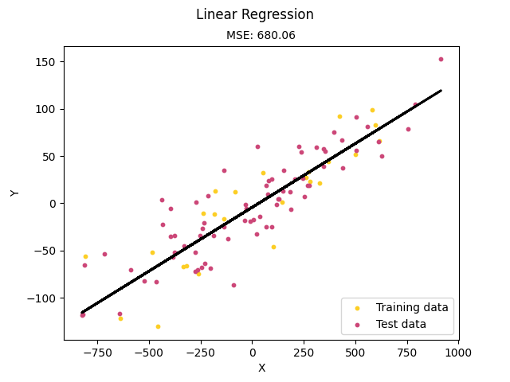
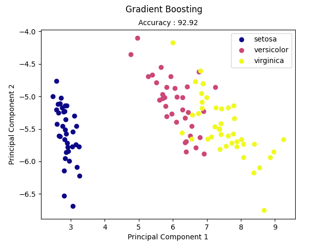

# Scratch ML


## About 

Implementations of the Machine Learning models and algorithms from scratch using NumPy only.
The purpose of this project is to learn the internal working of algorithms not to produce 
optimized algorithms.


## Implementations

Supervised Learning
* [Adaboost](https://github.com/siAyush/ScratchML/blob/main/scratch_ml/supervised_learning/adaboost.py)
* [Decision Tree](https://github.com/siAyush/ScratchML/blob/main/scratch_ml/supervised_learning/decision_tree.py)
* [Elastic Net](https://github.com/siAyush/ScratchML/blob/main/scratch_ml/supervised_learning/regression.py)
* [Gradient Boosting](https://github.com/siAyush/ScratchML/blob/main/scratch_ml/supervised_learning/gradient_boosting.py)
* [K Nearest Neighbors](https://github.com/siAyush/ScratchML/blob/main/scratch_ml/supervised_learning/knn.py)
* [Lasso Regression](https://github.com/siAyush/ScratchML/blob/main/scratch_ml/supervised_learning/regression.py)
* [Linear Discriminant Analysis](https://github.com/siAyush/ScratchML/blob/main/scratch_ml/supervised_learning/linear_discriminant_analysis.py)
* [Linear Regression](https://github.com/siAyush/ScratchML/blob/main/scratch_ml/supervised_learning/regression.py)
* [Logistic Regression](https://github.com/siAyush/ScratchML/blob/main/scratch_ml/supervised_learning/logistic_regression.py)
* [Naive Bayes](https://github.com/siAyush/ScratchML/blob/main/scratch_ml/supervised_learning/naive_bayes.py)
* [Random Forest](https://github.com/siAyush/ScratchML/blob/main/scratch_ml/supervised_learning/random_forest.py)
* [Ridge Regression](https://github.com/siAyush/ScratchML/blob/main/scratch_ml/supervised_learning/regression.py)
* [XGBoost](https://github.com/siAyush/ScratchML/blob/main/scratch_ml/supervised_learning/xgboost.py)


## Installation

```
$ git clone https://github.com/siAyush/ScratchML.git
$ cd ScratchML
$ python3 setup.py install
```


## Run Examples

```
$ python3 scratch_ml/demo/{filename}.py
```

Note : "filename" is replaced by the file you want to run.

Example: 
```
$ python3 scratch_ml/demo/k_nearest_neighbor.py
```


## Examples

### Linear Regression

```
$ python3 scratch_ml/demo/linear_regression.py 
```



### Gradient Boosting Classifier
```
$ python3 scratch_ml/demo/gradient_boosting_classifier.py
```
