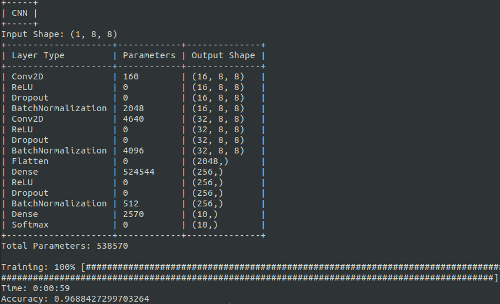

<h1 align="center">Scratch ML</h1>

<p align="center">
    
    
</p>

## About

Implementations of the Machine Learning models and algorithms from scratch using NumPy only.
The purpose of this project is to learn the internal working of algorithms not to produce
optimized algorithms.

## Implementations

Supervised Learning

- [Adaboost](https://github.com/siAyush/ScratchML/blob/main/scratch_ml/supervised_learning/adaboost.py)
- [Decision Tree](https://github.com/siAyush/ScratchML/blob/main/scratch_ml/supervised_learning/decision_tree.py)
- [Elastic Net](https://github.com/siAyush/ScratchML/blob/main/scratch_ml/supervised_learning/regression.py)
- [Gradient Boosting](https://github.com/siAyush/ScratchML/blob/main/scratch_ml/supervised_learning/gradient_boosting.py)
- [K Nearest Neighbors](https://github.com/siAyush/ScratchML/blob/main/scratch_ml/supervised_learning/knn.py)
- [Lasso Regression](https://github.com/siAyush/ScratchML/blob/main/scratch_ml/supervised_learning/regression.py)
- [Linear Discriminant Analysis](https://github.com/siAyush/ScratchML/blob/main/scratch_ml/supervised_learning/linear_discriminant_analysis.py)
- [Linear Regression](https://github.com/siAyush/ScratchML/blob/main/scratch_ml/supervised_learning/regression.py)
- [Logistic Regression](https://github.com/siAyush/ScratchML/blob/main/scratch_ml/supervised_learning/logistic_regression.py)
- [Naive Bayes](https://github.com/siAyush/ScratchML/blob/main/scratch_ml/supervised_learning/naive_bayes.py)
- [Random Forest](https://github.com/siAyush/ScratchML/blob/main/scratch_ml/supervised_learning/random_forest.py)
- [Ridge Regression](https://github.com/siAyush/ScratchML/blob/main/scratch_ml/supervised_learning/regression.py)
- [Support Vector Machine](https://github.com/siAyush/ScratchML/blob/main/scratch_ml/supervised_learning/support_vector_machine.py)
- [XGBoost](https://github.com/siAyush/ScratchML/blob/main/scratch_ml/supervised_learning/xgboost.py)

Unsupervised Learning

- [K Means](https://github.com/siAyush/ScratchML/blob/main/scratch_ml/unsupervised_learning/k_means.py)
- [Principal Component Analysis](https://github.com/siAyush/ScratchML/blob/main/scratch_ml/unsupervised_learning/principal_component_analysis.py)

Deep Learning

- [Perceptron](https://github.com/siAyush/ScratchML/blob/main/scratch_ml/deep_learning/perceptron.py)
- [Multilayer Perceptron](https://github.com/siAyush/ScratchML/blob/main/scratch_ml/deep_learning/multilayer_perceptron.py)
- [Neural Network](https://github.com/siAyush/ScratchML/blob/main/scratch_ml/deep_learning/neural_network.py)

- [Layers](https://github.com/siAyush/ScratchML/blob/main/scratch_ml/deep_learning/layers.py)

  - Activation Layer
  - Average Pooling Layer
  - Batch Normalization Layer
  - Constant Padding Layer
  - Convolutional Layer
  - Dropout Layer
  - Flatten Layer
  - Fully-Connected Layer
  - Max Pooling Layer
  - Reshape Layer
  - RNN Layer
  - Up Sampling Layer
  - Zero Padding Layer

- Models

  - [Autoencoder](https://github.com/siAyush/ScratchML/blob/main/scratch_ml/demo/autoencoder.py)
  - [Convolutional Neural Network](https://github.com/siAyush/ScratchML/blob/main/scratch_ml/demo/convolutional_neural_network.py)
  - [Generative Adversarial Network](https://github.com/siAyush/ScratchML/blob/main/scratch_ml/demo/generative_adversarial_network.py)
  - [Neural Network](https://github.com/siAyush/ScratchML/blob/main/scratch_ml/demo/neural_network.py)
  - [Recurrent Neural Network](https://github.com/siAyush/ScratchML/blob/main/scratch_ml/demo/recurrent_neural_network.py)

## Installation

```
$ git clone https://github.com/siAyush/ScratchML.git
$ cd ScratchML
$ python3 setup.py install
```

## Run Examples

```
$ python3 scratch_ml/demo/{filename}.py
```

Note : "filename" is replaced by the file you want to run.

Example:

```
$ python3 scratch_ml/demo/k_nearest_neighbor.py
```

## Examples

### Linear Regression

```
$ python3 scratch_ml/demo/linear_regression.py
```
<div align="center">


</div>

### Gradient Boosting Classifier

```
$ python3 scratch_ml/demo/gradient_boosting_classifier.py
```
<div align="center">


</div>

### Neural Network

```
$ python3 scratch_ml/demo/neural_network.py
```
<div align="center">


</div>

### Convolutional Neural Network

```
$ python3 scratch_ml/demo/convolutional_neural_network.py
```
<div align="center">




</div>
